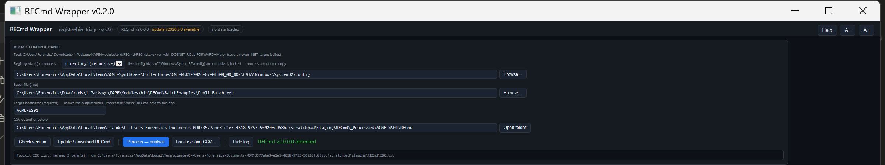

# RECmd-Wrapper

A single-file GUI for **Windows registry-hive triage** with Eric Zimmerman's [RECmd](https://github.com/EricZimmerman/RECmd) in batch mode — runs RECmd for you (default batch: `Kroll_Batch.reb`) and turns the output into an interactive, suspicion-scored persistence-triage view. One `.hta`, no install, part of the [DFIR-Windows-Artifact-Finder](https://github.com/bpmorris22/DFIR-Windows-Artifact-Finder) wrapper family.



> Control panel — hive/collection input, batch file selection (`Kroll_Batch.reb` default), engine detected,
> toolkit IOC list merged. Screenshot uses synthetic paths (fake host `ACME-WS01`) — no real case data.

## Quick start

1. Put `RECmd-Wrapper.hta` anywhere and double-click it — use **Update / download RECmd** to fetch the engine (the whole `RECmd\` folder incl. `Plugins\` and `BatchExamples\` lands next to the app), or point it at an existing copy (KAPE `Modules\bin\RECmd` is found automatically).
2. Point the input at a hive file (`SYSTEM`, `SOFTWARE`, `NTUSER.DAT`, `UsrClass.dat`, …) or a folder — directory mode recurses, so a whole Velociraptor/KAPE collection works. Transaction logs (`.LOG1/.LOG2`) beside the hive are replayed automatically; a dirty hive without logs is auto-retried with `--nl`.
3. Confirm the **Target hostname** guess, then **Process → analyze**. Or **Load existing CSV…** to view a RECmd batch CSV you already have.

## Views & scoring

- **Findings** (default), **Timeline** (by key last-write), and **Categories** (grouped per batch category) — sortable, filterable, resizable columns, detail pane, CSV export.
- Suspicion scoring **R1–R7**: IOC/keyword hits, autoruns/services pointing at user-writable paths, LOLBin/script invocations, hijack-prone locations (IFEO, AppInit_DLLs, netsh helpers, LSA packages, …), deleted entries, base64-looking blobs, remote paths in autoruns. Threshold is deliberately conservative — registry batch output is noisy by design.

## Command line

```
mshta "RECmd-Wrapper.hta" "<inputOrCsv>" ["<outDir>"] [/auto] [/from:yyyy-MM-dd] [/to:yyyy-MM-dd]
```

- `<input>` — a `.csv` (auto-loads into the viewer) or a hive file / folder (prefilled; processed with `/auto`).
- `<outDir>` — CSV output directory (optional; defaults to `_Processed\<host>\RECmd` next to the app).
- **Target hostname** is required before processing — it names the `_Processed\<host>\RECmd` output folder next to the app (family convention shared with the DFIR-Windows-Artifact-Finder, so processed evidence is visible per host per tool). Guessed from `Collection-<host>-…` paths, a passed `_Processed\<host>\` outDir, or this machine's name for live paths — overwrite the guess if it's wrong.
- **Shared IOC list** — an `IOC.txt` next to the app (one term per line, `#` comments) is auto-merged into the IOC box at launch; one list covers the whole toolkit and terms you paste locally are kept.
- **Run provenance + triage summary** — every successful run appends a `runinfo.json` entry (app, host, input path, files) in the output folder, including a triage summary (entries, flagged count, max score, top hits); the DFIR-Windows-Artifact-Finder shows these per host in its inventory, even for standalone runs.
- `/from:yyyy-MM-dd` `/to:yyyy-MM-dd` — case window (UTC, inclusive): prefills the date filter and is recorded in `runinfo.json`; never affects scoring. The [DFIR-Windows-Artifact-Finder](https://github.com/bpmorris22/DFIR-Windows-Artifact-Finder) passes these on every launch.

## Notes

- Batch file is selectable — anything in `BatchExamples\` (or your own `.reb`) works; `Kroll_Batch.reb` is the comprehensive community default.
- All timestamps are UTC. Live `C:\Windows\System32\config` hives are exclusively locked — collect first (Velociraptor/KAPE), then point the wrapper at the collection.
- Columns are resizable — drag a header's right edge; double-click the edge to reset. Widths are remembered per view.

MIT © 2026 Ben Morris
